                              AWS EventBridge Real-Time Notification Architecture

  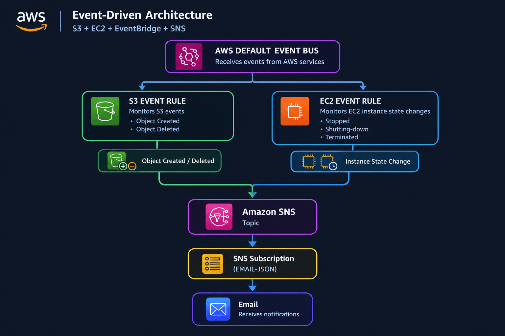

Project Overview

This project demonstrates how to build an automated, event-driven monitoring and alerting system using AWS EventBridge and Amazon Simple Notification Service (SNS). The primary objective is to capture real-time infrastructure events—specifically Amazon S3 object creation/deletion and Amazon EC2 instance state changes—and dispatch instant alert notifications to designated email endpoints.

Services Used

Amazon EventBridge
Amazon S3 (Simple Storage Service)
Amazon EC2 (Elastic Compute Cloud)
Amazon SNS (Simple Notification Service)

Configuration Details

| Parameter | Configuration |
| :--- | :--- |
| AWS Region | Europe (Ireland) `eu-west-1` |
| EC2 Instance | `t3.micro` (Name: `MY_SERVER`) |
| S3 Bucket | `amazon-bucket-eb` |
| Event Bus | `default` |
| EventBridge Rule | `my_rule` |
| SNS Topic Name | `Public_Topic` |
| SNS Subscriptions | `EMAIL`, `EMAIL-JSON` |

Step 1 - Provision Resources

Launched an Amazon EC2 instance named `MY_SERVER` (`t3.micro`) in the `eu-west-1b` Availability Zone and created an Amazon S3 bucket named `amazon-bucket-eb` to serve as event sources.

Step 2 - Configure the Notification Layer (SNS)

Created an Amazon SNS Topic named `Public_Topic` (Standard Topic) and configured two confirmed email subscriptions (`EMAIL` and `EMAIL-JSON`) to receive automated alerts upon event triggering.

Step 3 - Set Up EventBridge Rules

Created an EventBridge Rule named `my_rule` on the `default` event bus. Configured event pattern filtering for:

Amazon S3: Object creation (`PutObject`) and deletion (`DeleteObject`) events on `amazon-bucket-eb`.

Amazon EC2: Instance state-change notifications for `MY_SERVER`.

Targeted the SNS topic `Public_Topic` with an IAM execution role granting EventBridge permissions to publish messages to SNS.

Step 4 - Trigger Events and Verify Endpoints

Simulated infrastructure events to test end-to-end routing:

S3 Event Verification: Uploaded and deleted files (`2,3.pdf`, `Aditya_Resume-1.pdf`) in `amazon-bucket-eb` to generate S3 event payloads.

EC2 Event Verification: Stopped `MY_SERVER` to generate an EC2 state-change notification (`stopped`).

Email Verification: Received automated JSON alert payloads directly in the subscribed inbox detailing both S3 object events and EC2 state changes.

Project Verification & Screenshots

Step 01 - Architecture Diagram:

Step 02 - EventBridge Target Configuration:

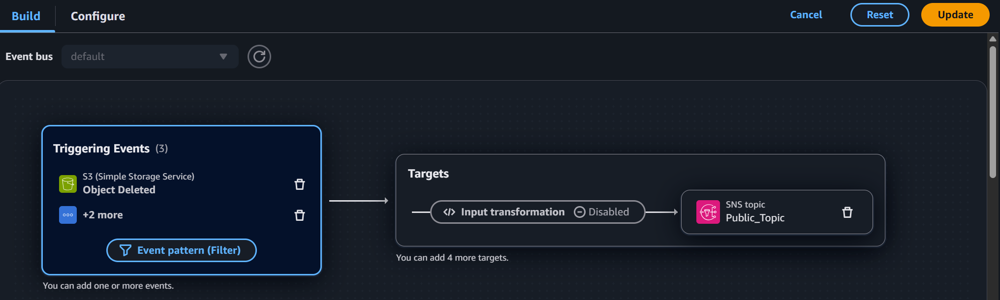

Step 03 - EventBridge Rules Overview:

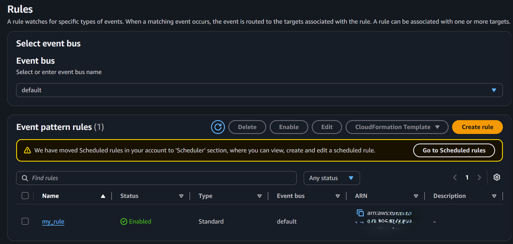

Step 04 - Monitored S3 Bucket (amazon-bucket-eb):

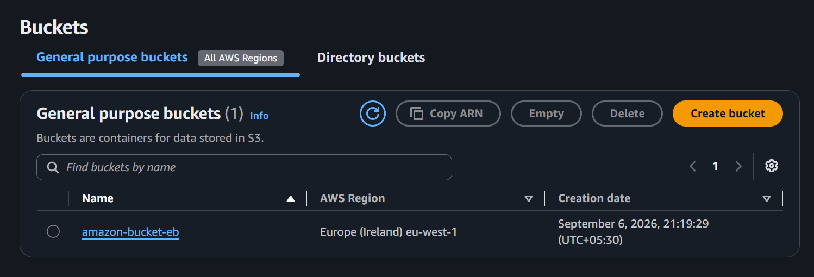

Step 05 - Configured SNS Topic & Subscriptions:

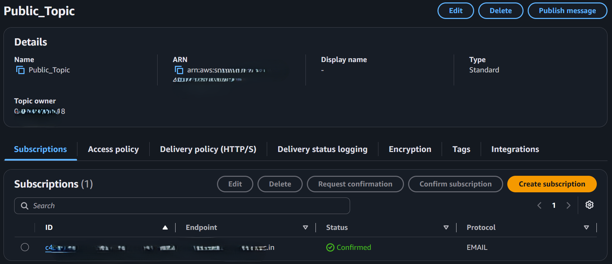

Step 06 - Monitored EC2 Instance (MY_SERVER):

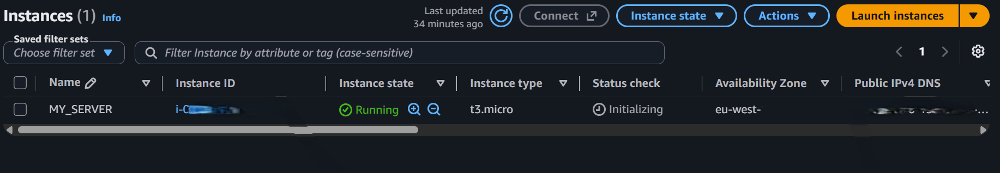

Step 07 - Confirmed SNS Subscription Endpoint:

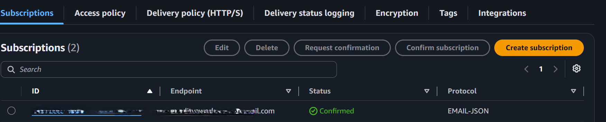

Step 08 - Target Configuration & IAM Execution Role:

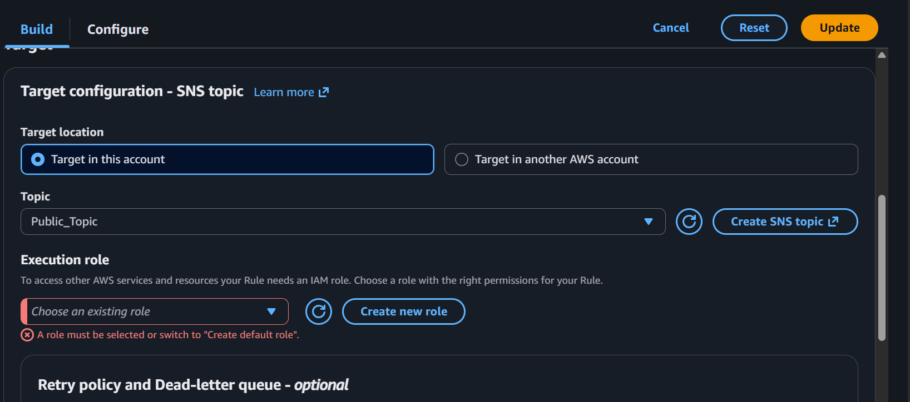

Step 09 - S3 Bucket Object Activity:

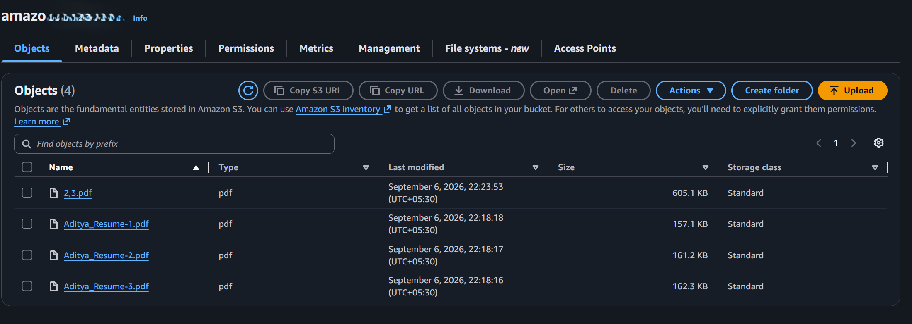

Step 10 - S3 Event Email Notification Received:

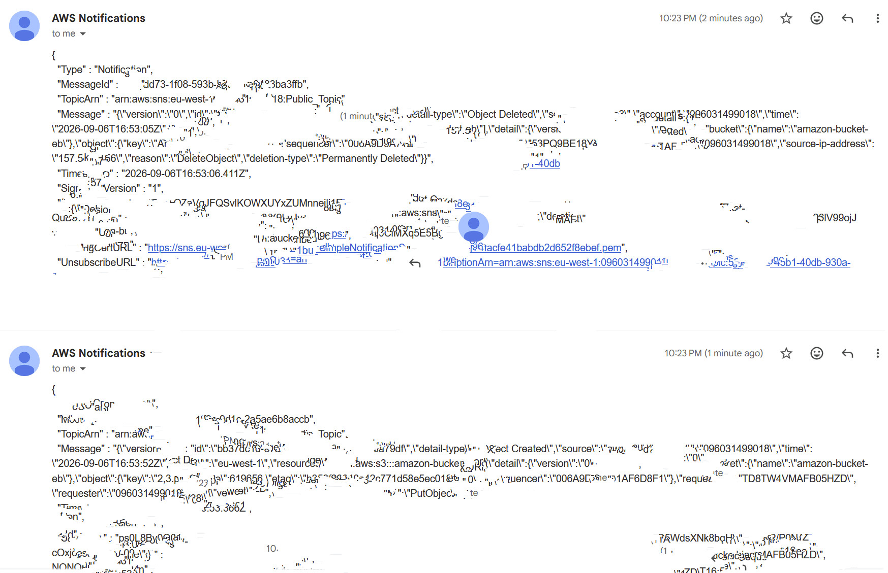

Step 11 - EC2 State Change Email Notification Received:

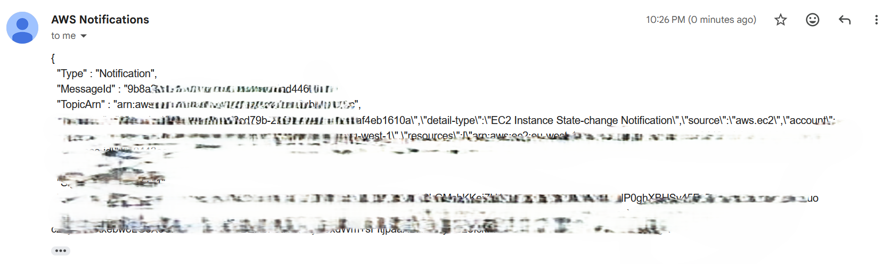

Testing & Verification

Confirmed that AWS EventBridge intercepts real-time S3 object events and EC2 instance state changes on the `default` bus.

Verified seamless event routing from EventBridge rules to Amazon SNS topics using IAM roles.

Validated automated alert delivery of formatted JSON payloads across multiple email endpoints.

Learning Outcomes

Engineered an event-driven monitoring system using serverless AWS components.

Configured EventBridge event patterns to capture multi-service resource events.

Managed Amazon SNS topics and email subscription endpoints.

Applied proper IAM policies to permit EventBridge target invocation.

Author

ADITYA MANIVANNAN

AWS Cloud | DevOps Engineer
